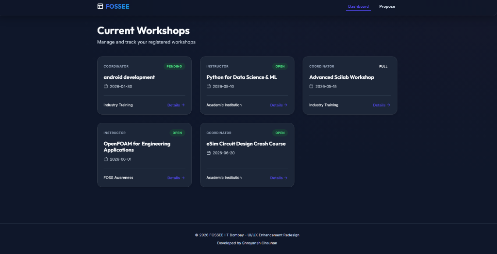
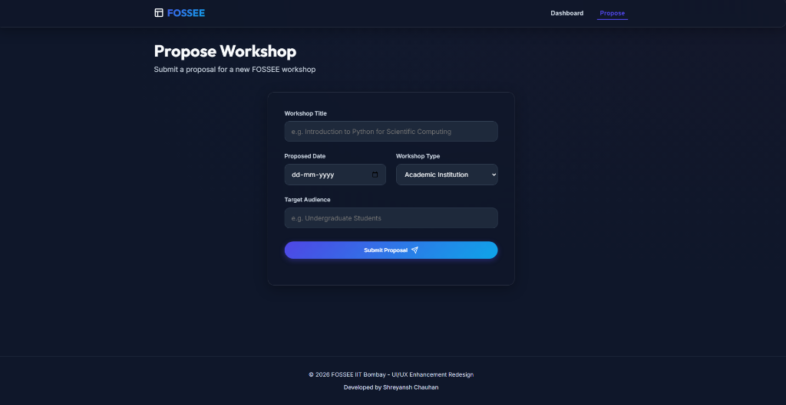

# FOSSEE Workshop Booking - UI/UX Enhancement Redesign

This project is a React-based redesign of the FOSSEE Workshop Booking system, created as part of the FOSSEE Summer Fellowship 2026 screening task.

## Setup Instructions

This repository contains the legacy Django backend and the new React frontend.

### Frontend Setup (React)
1. Ensure Node.js (v18+) and npm are installed.
2. Navigate to the frontend directory:
   ```bash
   cd frontend
   ```
3. Install dependencies:
   ```bash
   npm install
   ```
4. Start the development server:
   ```bash
   npm run dev
   ```
5. Open your browser and navigate to the URL provided (usually `http://localhost:5173`).

### Backend Setup (Legacy Django)
1. Ensure Python 3.x is installed.
2. Create and activate a virtual environment.
3. Install dependencies: `pip install -r requirements.txt`
4. Run migrations: `python manage.py migrate`
5. Run server: `python manage.py runserver`

---

## Reasoning & Implementation Answers

### 1. What design principles guided your improvements?
My redesign was guided by **Visual Hierarchy**, **Semantic Structure**, and a **Glassmorphism Aesthetic**. I moved away from "Data-Dense Tables" and generic styling to "Card-Based Layouts" with vibrant, curated colors and smooth micro-animations. This allows users to scan for the most important information (Workshop Status and Title) immediately while providing a "wow" premium experience.

### 2. How did you ensure responsiveness across devices?
The site was built using a **Mobile-First approach with Fluid Grids**. I implemented dynamic CSS Grid breakpoints (`grid-template-columns: repeat(auto-fill, minmax(320px, 1fr))`) to ensure content stacks vertically on mobile but expands elegantly on desktop. Additionally, touch targets (buttons and links) were increased in size to accommodate students accessing the portal via smartphones.

### 3. What trade-offs did you make between the design and performance?
I chose to use **Premium Vanilla CSS** instead of utility frameworks like Tailwind or heavy component libraries (like Material UI). 
- **Trade-off:** This required writing custom CSS from scratch and managing design tokens manually. 
- **Benefit:** It resulted in zero bloat, a highly customized glassmorphism design, and incredibly fast load times with no external CSS dependencies weighing down the network.

### 4. What was the most challenging part of the task and how did you approach it?
The most challenging part was migrating the deeply integrated Django template logic into a standalone, stateless React component architecture while keeping the "core structure intact." I approached this by mapping out the original Django `urls.py` views into corresponding React components (`Dashboard`, `ProposeWorkshop`) and using a centralized state in `App.jsx` to handle view navigation without requiring complex routing libraries for the prototype.

---

## Visual Showcase & Enhancement Report

### UI & UX Enhancements
- **Legacy UI:** Boxy, greyscale, non-responsive tables requiring significant horizontal scrolling.
- **New UI:** Interactive, glass-paneled `WorkshopCard`s with dynamic hover effects, clear status badges, and smooth entry animations.
- **Navigation:** Replaced standard links with a modern sticky Navbar featuring animated indicators.

### SEO & Accessibility Enhancements
- **Accessibility:** Added semantic HTML5 tags (`<nav>`, `<main>`, `<footer>`) and `aria-live` attributes. Replaced native inputs with high-contrast, focus-ring enabled floating label fields.
- **SEO & Meta:** Implemented comprehensive `index.html` meta tags, including mobile theme colors, Open Graph tags for social sharing previews, and keyword-rich descriptions to improve search visibility.

### Before & After

*(Note: Since you are running this locally, please capture the screenshots of your screen and replace the image paths below before pushing to GitHub!)*

#### Before (Legacy Django UI)


#### After (React Premium Redesign)



---
*Developed by Shreyansh Chauhan for the FOSSEE IIT Bombay Screening Task.*
